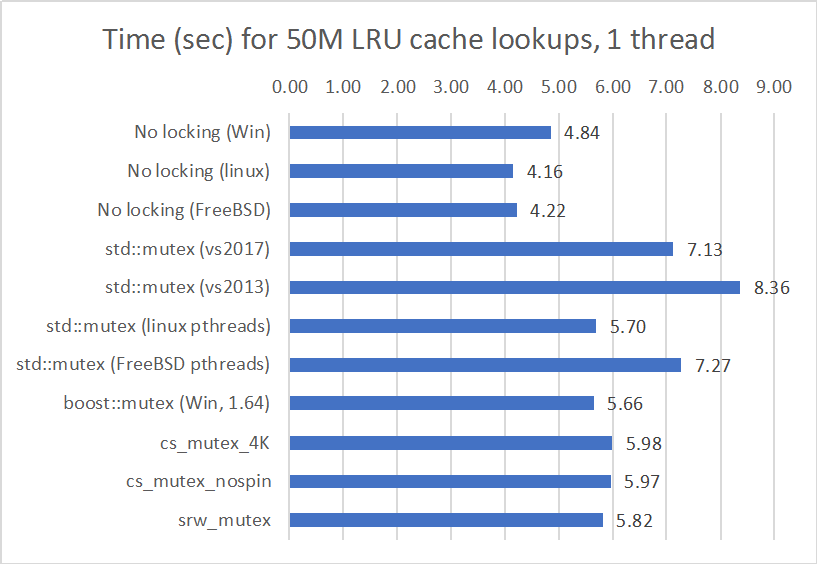
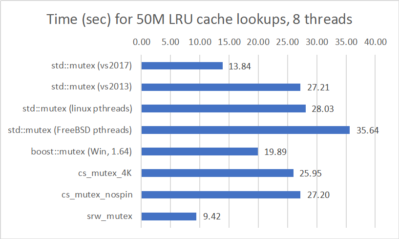

# Yet another mutex shootout

## Summary

A quick benchmark that measures the performance of different Windows mutex
implementations when synchronizing access to an LRU cache. The goal is
to answer 2 questions:

1. How much overhead does locking introduce when protecting a
semi-realistic data structure under no contention?

2. What kind of mutex performs best under heavy contention? (Fairness
is not a concern.)

The LRU cache is implemented using 
[boost.bimap](http://www.boost.org/doc/libs/release/libs/bimap/doc/html/index.html),
using a UUID as a key
(hashed with MurmurHash3) to retrieve a 2KB buffer under a
course-grained lock. I chose an LRU cache because it's a data
structure that often needs some form of synchronization: just
performing a simple read will change its state.

Unless otherwise noted in third-party libraries (like Boost
and MurmurHash3), code for this benchmark is in the public domain.

## The Contenders

 - **std::mutex (VS 2017)**: The standard mutex provided by Visual
   Studio 2017's C++ runtime library. This is implemented with a
   Windows SRWLOCK.
 - **boost::mutex**: Provided by the Boost.Thread library. Best I can
   tell, Boost implemented
   [their own](https://github.com/boostorg/thread/blob/develop/include/boost/thread/win32/basic_timed_mutex.hpp) fast
   user-mode mutex for Windows that waits on an event object if there's
   contention.
 - **srw_mutex**: A lightweight custom mutex that wraps a Windows
   slim reader/writer lock
   ([code](https://github.com/markwaterman/MutexShootout/blob/27560771225d8010aa59ce15282588d7f2923f7d/alt_mutex.hpp#L46)). I
   included this to see how much overhead (if any) Microsoft's
   std::mutex implementation adds to raw SRWLOCK performance.
 - **cs\_mutex\_4K**: A custom C++ mutex that uses a Windows
   critical section object
   ([code](https://github.com/markwaterman/MutexShootout/blob/27560771225d8010aa59ce15282588d7f2923f7d/alt_mutex.hpp#L12)). A
   critical section can optionally behave like a spinlock before
   dipping down into kernel mode, so this mutex uses a spin count
   of 4000. ([InitializeCriticalSectionAndSpinCount](https://msdn.microsoft.com/en-us/library/windows/desktop/ms683476(v=vs.85).aspx)
   docs say that 4000 is a reasonable value that MS uses for their
   heap manager).
 - **cs\_mutex\_nospin**: The same Windows critical section mutex as
   above, but this one has its spin count set to zero.
 - **std::mutex (VS 2013)**: The standard mutex provided by Visual
   Studio 2013's C++ runtime library, implemented using Windows'
   Concurrency Runtime (Microsoft's effort to introduce user-mode
   cooperative scheduling to Windows, which they've abandoned in
   recent C++ runtimes. I'm curious to see why).
 - **(Bonus!) std::mutex (Linux)**: We'll benchmark on Linux too,
   entirely for entertainment purposes.
   The standard C++ libraries for GCC and Clang (as well as
   Boost) all use the Pthreads mutex, which, in turn, is implemented
   using a futex on Linux
   ([details](https://linux.die.net/man/7/pthreads)).
 - **(_Even More_ Bonus!) std::mutex (FreeBSD)**: I have a lot of
   [free GCE
   credits](https://cloud.google.com/free/docs/frequently-asked-questions#free-trial)
   burning a hole in my pocket, so I'll throw FreeBSD into the
   mix. Pthreads on FreeBSD doesn't appear to use a fast userspace
   mutex like Linux, so expect some performance differences.

## The Environment

  * Google Compute Engine (us-west1-b)
  * n1-standard-8 VM (8 vCPUs, 30 GB memory, 2.2 GHz Intel Broadwell
    Xeon E5 v4).

### Windows

  * Windows Server 2016
  * Visual Studio 2017 (15.2)
  * Visual Studio 2013 (Update 5)

### Linux

  * Ubuntu 17.04 (amd64 zesty image built on 2017-07-20)
  * gcc (Ubuntu 6.3.0-12ubuntu2) 6.3.0 20170406

### FreeBSD

  * FreeBSD 11.1
  * Clang version 4.0.0 (tags/RELEASE_400/final 297347) (based on LLVM 4.0.0)

## Results

### One Thread: How much overhead does locking add?

### Eight Threads: Which mutex scales best?

## Conclusions

1. Overall, most of the mutexes are in the same ballpark when there's
   no contention, adding some measurable overhead: VS 2017's std::mutex
   increases cache lookup times by 47% over an unsynchronized cache. You can
   cut this overhead down to 20% if you use a raw SRWLOCK on
   Windows. I didn't dig into what Microsoft's std::mutex does beyond
   basic locking, but whatever they're doing has an impact.
2. In the highly contended scenario, Windows wins the day with its
   SRWLOCK (and once again, the VS 2017 std::mutex adds some overhead
   on top of the SRWLOCK).  PThreads on Linux and FreeBSD appear to be
   optimized for light contention, so if you have a poorly written app
   that's bottlenecked on a lock, then consider targeting Windows to
   make the best of a bad situation.
   
### Other Observations

* The hybrid spinlock behavior of _cs\_mutex\_4K_ offered no benefit in
  either test. Spinning increased CPU usage in my high-contention
  scenario with minimal performance benefit. I suspect the locking in
  this LRU cache is too course-grained for spinlock behavior to make 
  a big difference.
* Based on this one little benchmark, Microsoft's move away from the
  Concurrency Runtime appears to be wise. Plus, if you increase the
  contention using servers with even more cores (16+), then the old VS
  2013 mutex becomes pathologically slow. (I didn't include
  pathological results here because the scenario is starting to get
  silly.)